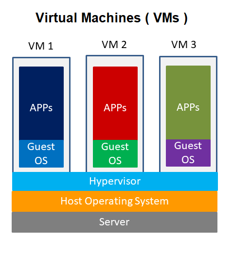
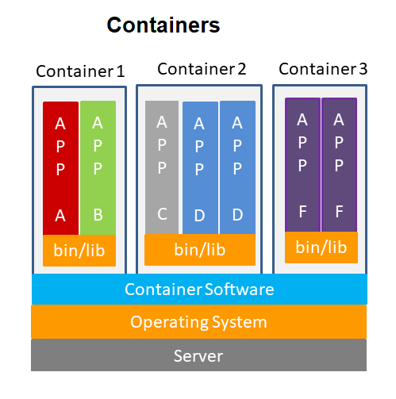
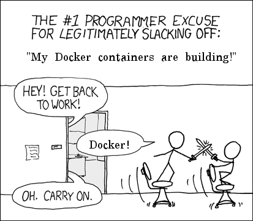
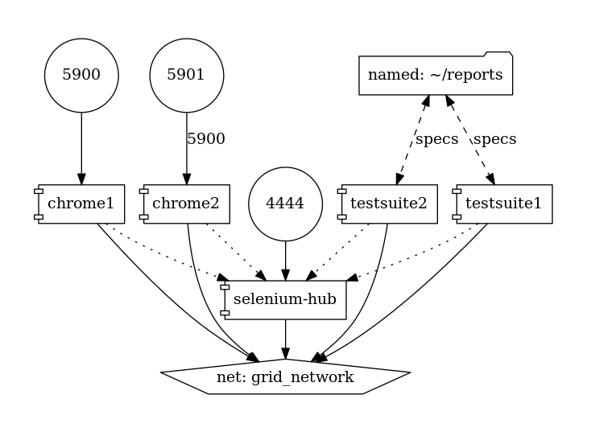
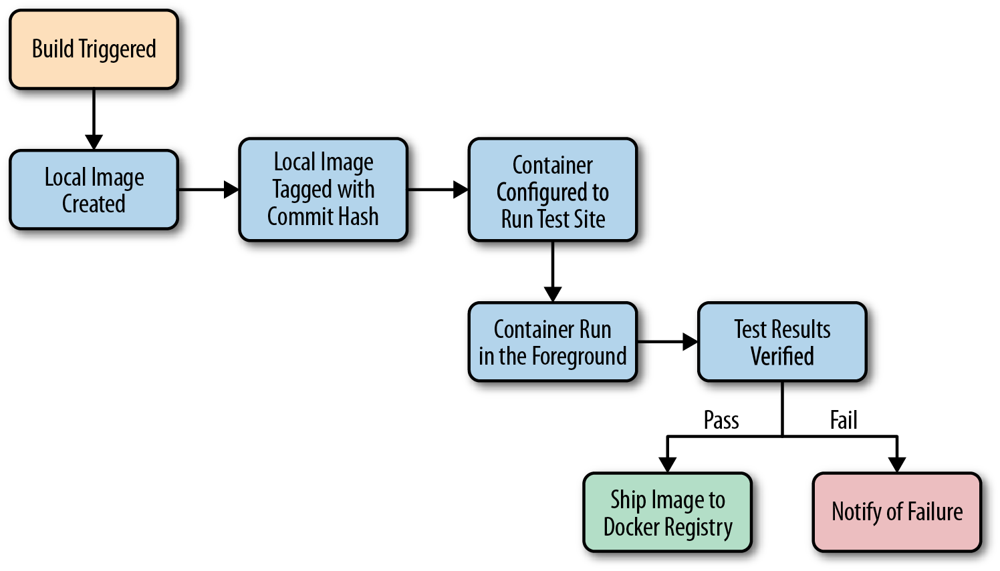

# Introduction {data-background-image="images/redPanda_background.png"}

# Why Docker? {data-background-image="images/docker_icon.png" data-background-opacity=0.8 data-background-size="400px" data-background-position="left 3em bottom 0px"}

## Problems 

- Works On Machine
- Application Deployment 
- Configuration Management 
- Continuous Delivery
- Scaling Application
- Rolling Back Deployment

## Divergent

- Manual configuration 
- Shell scripts
- apt, yum, pacman


## Convergent

- Puppet, Chef, Ansible
 
## Congruent

- Docker


# Virtualisation and Containerisation 

## 



## 



## LXC

- namespace
- cgroups
- chroot


# Setup

## Ubuntu

```bash
curl -fsSL https://download.docker.com/linux/ubuntu/gpg \ 
| sudo apt-key add -

sudo apt-get install \
software-properties-common \
python-software-properties

sudo add-apt-repository \
"deb [arch=amd64] 
https://download.docker.com/linux/ubuntu 
$(lsb_release -cs) stable"

sudo apt-get update
apt-cache policy docker-ce
sudo apt-get install -y docker-ce
sudo usermod -aG docker ${USER}
#Logout user and Login again
```

## Hello World

```bash
docker run hello-world
```


# Docker Concepts

## Docker Image

An image is an executable package that includes everything needed to run an application--the code, a runtime, libraries, environment variables, and configuration files.

## Docker Container
A container is a runtime instance of an image--what the image becomes in memory when executed (that is, an image with state, or a user process). You can see a list of your running containers with the command, docker ps, just as you would in Linux.

## Demo: Greeting

Create docker image which *cats* a file

```bash
#Build docker Image 
docker build -t greeting .
#List image
docker image ls
#List containers 
docker container ls
```


::: notes

Demo docker greeting image

:::

## 


# Dockerfile

## Dependencies

- System environment : *node, python, jdk*
- Lock all requirements : *pip_freeze, package-lock.json*
- Extra dependencies *ca-certificates cryptography ffmpeg imagemagick*
- Configuration files
- User role & permissions

::: notes

[Dockerfile reference](https://docs.docker.com/engine/reference/builder/)

:::

## Python Flask application

```
docker build --tag=friendlyhello .
docker run -p 4000:80 friendlyhello
```

## 



## Docker build context

- All recursive contents of files and directories in the current directory are sent to the Docker daemon as the build context.
- To exclude files not relevant to the build use a *.dockerignore* file

## Leverage build cache

- When building an image, Docker steps through the instructions in your Dockerfile, executing each in the order specified. As each instruction is examined, Docker looks for an existing image in its cache that it can reuse, rather than creating a new (duplicate) image.
- Once the cache is invalidated, all subsequent Dockerfile commands generate new images and the cache is not used.

::: notes

[Best practices](https://docs.docker.com/develop/develop-images/dockerfile_best-practices/)

Demo & Update flaskApp Dockerfile

:::

## MultiStage Build

```bash
FROM golang:1.7.3
WORKDIR /go/src/github.com/alexellis/href-counter/
RUN go get -d -v golang.org/x/net/html  
COPY app.go .
RUN CGO_ENABLED=0 GOOS=linux go build -a -installsuffix cgo -o app .

FROM alpine:latest  
RUN apk --no-cache add ca-certificates
WORKDIR /root/
COPY --from=0 /go/src/github.com/alexellis/href-counter/app .
CMD ["./app"] 
```

::: notes

[MultiStage Build](https://docs.docker.com/develop/develop-images/multistage-build/)

:::

## Storing Metadata

```bash 
docker build -t <image> \
--build-arg GIT_TAG=$(echo "$(git rev-parse \
--abbrev-ref HEAD) \
"_"$(git rev-parse --short HEAD)") .\

```

## ARG and LABEL

```
ARG GIT_TAG=unspecified
LABEL git_tag=$GIT_TAG
```

::: notes

Show using inspect command

ARG variables are not persisted into the built image as ENV variables are. However, ARG variables do impact the build cache in similar ways. If a Dockerfile defines an ARG variable whose value is different from a previous build, then a “cache miss” occurs upon its first usage, not its definition. In particular, all RUN instructions following an ARG instruction use the ARG variable implicitly (as an environment variable), thus can cause a cache miss. All predefined ARG variables are exempt from caching unless there is a matching ARG statement in the Dockerfile.

:::


## Docker RUN

- Detached (-d) or Foreground (-it)
- Port binding (-p)
- Volume mount (-v)
- Clean up (--rm)
- Workdir (-w)
- Link (--link )
- ENV (--env)

::: notes

Host binding for volume and port
[Docker run reference](https://docs.docker.com/engine/reference/run/)

:::

## Exercise

Objective: Dockerise Reactjs app.

## Dockerise React App

- Dependency to build Reactjs App
- How to serve build over http?

## Code mount vs Code add

::: notes

Possible Break 

:::


# Docker Compose file

## 

- *Services* are really just “containers in production.” A service only runs one image, but it codifies the way that image runs—what ports it should use, how many replicas of the container should run so the service has the capacity it needs, and so on. Scaling a service changes the number of container instances running that piece of software, assigning more computing resources to the service in the process.
- A *swarm* is a group of machines that are running Docker and joined into a cluster.

::: notes

[Compose file reference](https://docs.docker.com/compose/compose-file/)

:::

## 

```
docker swarm init
docker stack deploy -c docker-compose.yml demo
docker service ls
docker service ps demo_redis  --no-trunc
docker service|stack rm 
```

## Address resolution

## Process Manager

Avoid using process manager like 
python supervisor,pm2 inside docker

# Automation

## QA Automation



## CI Pipeline



## Useful Images

- Portainer
- pmsipilot/docker-compose-viz
- dockersamples/visualizer


# In Production

## Clean up Tasks

```bash
#Delete every container
docker rm -f $(docker ps -a -q)
# Delete every Docker image
docker rmi -f $(docker images -q)
#Remove Dangling images
docker rmi $(docker images -f "dangling=true" -q)
# Remove all untagged images
docker image rm -f \
$(docker image ls | grep "^<none>" | awk "{print $3}")
```

## Monitoring (Telemetry)

- [Configure logging drivers](https://docs.docker.com/config/containers/logging/configure/)
- [Collect Docker metrics with Prometheus](https://docs.docker.com/config/thirdparty/prometheus/)

## Warnings!

- Check host file system driver support for docker.
- Test kernel support of docker on cloud provided OS.
- Avoid production database using docker.
- Save build image to cloud

::: notes

- Ideally use ext4. Avoid btrfs.
- Linode provided kernel does not works.
- Reproducible builds & Dockerfile

:::


# Questions

## 

- How Docker runs on OSX or windows?
- If we build image on Macbook air, can we run this image on Windows laptop (i5 processor) or Raspberry pi ?

## Opensource Projects

- [Fedora Silverblue](https://silverblue.fedoraproject.org/)
- [Guix](https://guix.gnu.org/)
- [Nix](https://nixos.org/)

# Thank You!
